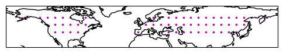

## Motivation

The aim is to estimate the dynamic trend in a specific target variable from a standard climate change simulation (comparable to observations). The result of the dynamic trend estimation is going to be evaluated with a counterfactual piControl-nudged simulation that is supposed to only contain the dynamic trend of the cliamte change simulation (see below).

## Data

### Standard climate change simulations (climChange)

We have three standard simulation runs with historic emissions until 2014 and SSP370 emissions from there on:

| run | 1850-2014 | 2015 - 2100 |
|:--|:--:|:--:|
| 1300 | b.e212.BHISTcmip6.f09_g17.1300 | b.e212.BSSP370cmip6.f09_g17.1300 |
| 1400 | b.e212.BHISTcmip6.f09_g17.1400 | b.e212.BSSP370cmip6.f09_g17.1400 |
| 1500 | b.e212.BHISTcmip6.f09_g17.1500 | b.e212.BSSP370cmip6.f09_g17.1500 |

In these runs greenhouse gas concentrations are rising over time leading to thermodynamic and dynamic changes.

### Nudged counterfactual simulations (piControl-nudged)

For each of the standard simulations from above there is one simulation in the piControl setting (no greenhouse gas emissions). The simulations is nudged towards the wind fields throughout the whole atmosphere of the respective simulations from above.

| run | 1850-2100 |
|:--|:--:|
| 1300 | b.e212.B1850cmip6.f09_g17.001.nudge-1850-2100-SSP370.1300.linear-weak |
| 1400 | b.e212.B1850cmip6.f09_g17.001.nudge-1850-2100-SSP370.1400.linear-weak |
| 1500 | b.e212.B1850cmip6.f09_g17.001.nudge-1850-2100-SSP370.1500.linear-weak |

## Locations

We test our methods on land grid-cells (?) around the northern hemispheric mid-latitudes. Grid-cells are located at around 50°N and spaced in 10° longitude steps. 

Latitudes, longitudes as well as the respective indices in the CESM2 output grid are listed in **`locations.csv`**

|    |     lat |   lon |   iy |   ix |
|:--|:--:|:--:|:--:|:--:|
|  0 | 50.4188 |    10 |  149 |    8 |
|  1 | 50.4188 |    20 |  149 |   16 |
|  2 | 50.4188 |    30 |  149 |   24 |
|  3 | 50.4188 |    40 |  149 |   32 |
|  ... | ... |    ... |  ... |   ... |

## Target variables

1) **TREFHT** - surface air temperature
2) *optional* **TOTPREC** - total preciptiation

## Seasons

1) **DJF** (December, January, February)
2) **JJA** (June, July, August)

## Statistics

1) seasonal mean
2) *optional* seasonal daily maximum 
3) *optional* seasonal daily minimum 

## Desired output (trends):

One csv table for each combination of target variable, season and statistic.

Seasonal trends over the period 1979-2023
* **reproduced total trend** (*should be similar to climChange run on which was trained*)
* **dynamic trend** (*should be similar to corresponding piControl-nudged run*)
* *optional* **thermodynamic trend**
* *optional* other decomposed trends you got from your method

| lat     |   lon |   run | reproduced trend | dynamic trend | thermodynamic trend | other columns ... |
|:-------:|:-----:|:-----:|:----------------:|:-------------:|:-------------------:|:-----------------:|
| 50.4188 |    10 |  1300 |          ?       |      ?        |     optional        |     optional      |
| 50.4188 |    10 |  1400 |          ?       |      ?        |     optional        |     optional      |
| 50.4188 |    10 |  1500 |          ?       |      ?        |     optional        |     optional      |
| 50.4188 |    20 |  1300 |          ?       |      ?        |     optional        |     optional      |
| 50.4188 |    20 |  1400 |          ?       |      ?        |     optional        |     optional      |
| ... | ... | ... | ... | ... | ... | ... | ... |

See example output file: **`TREFHT_JJA_seasmean.csv`**

## Daily output (optional):

If applicable/possible it would be even better if you could save the daily output of you estimates.

See example output file: **`TREFHT_JJA.nc`**